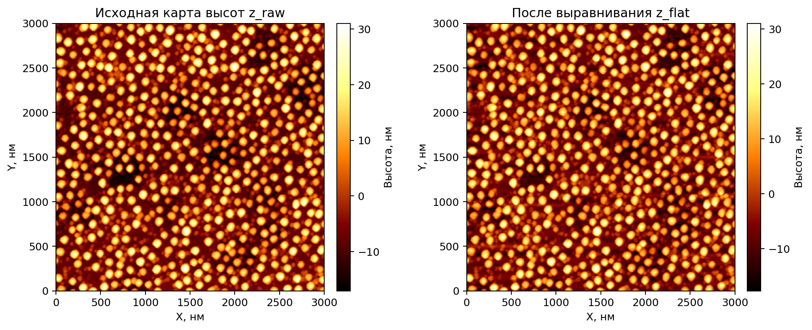
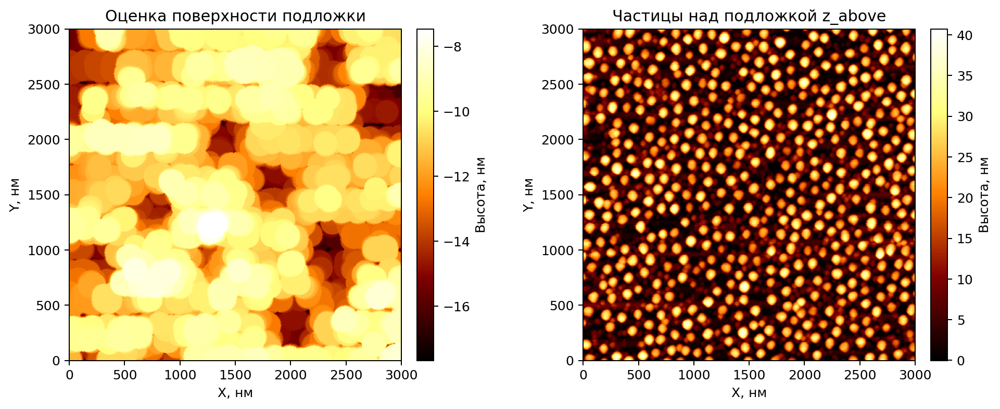
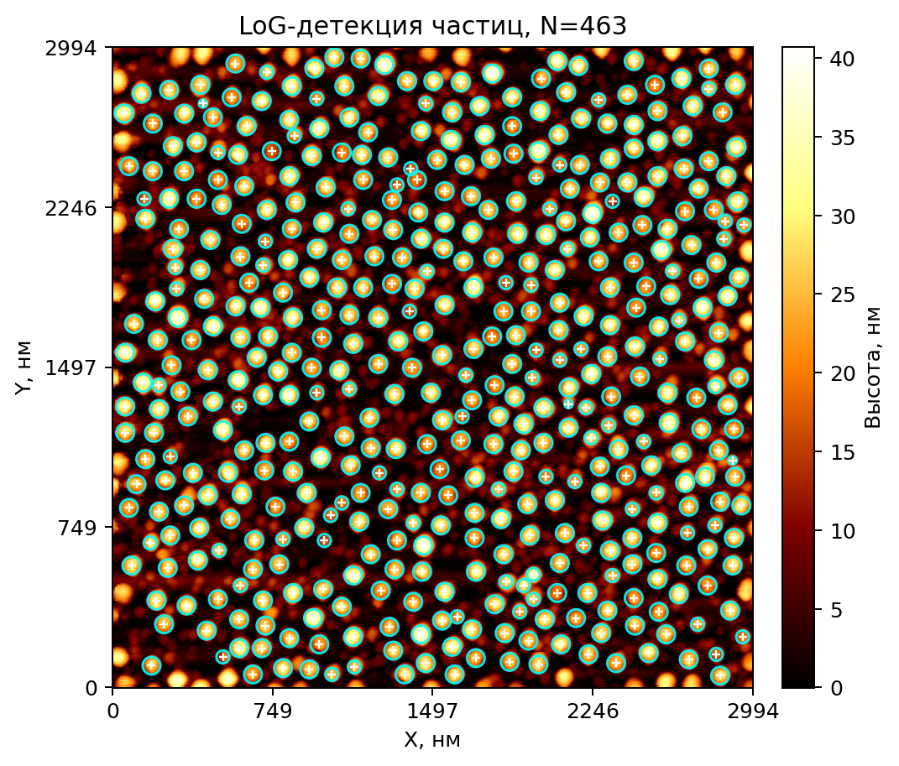
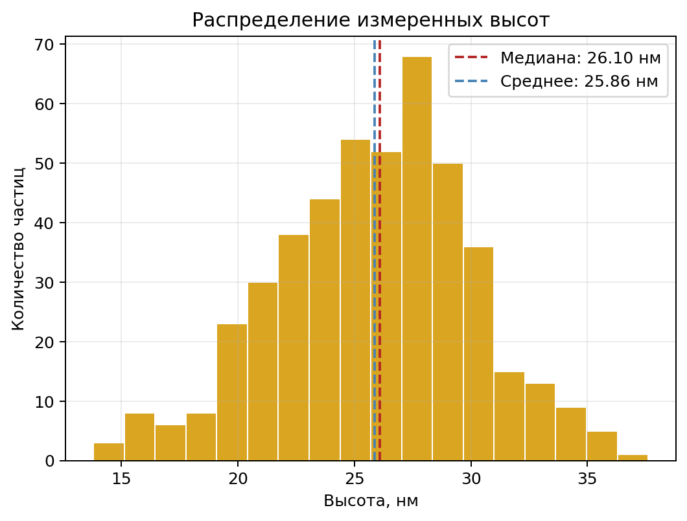

# AFM Nanoparticle Analysis

Однопроходный пайплайн для загрузки AFM-карт высот, удаления фона, детекции наночастиц и измерения их высоты.


## Что делает проект

AFM, или атомно-силовая микроскопия, даёт карту высот поверхности: каждый пиксель хранит локальную высоту в нанометрах. Для наночастиц это особенно полезно, потому что именно высота позволяет отделить реальные объекты от фона, оценить распределение размеров и сравнить разные образцы без перехода к косвенным метрикам.

В этом проекте собран автоматический пайплайн для обработки таких карт. Он загружает AFM-файл, убирает глобальный наклон и построчный тренд, оценивает поверхность подложки через morphological opening, выделяет частицы над подложкой, подбирает параметры LoG-детекции и измеряет высоту каждой найденной частицы относительно локального baseline.

На выходе получается `pandas.DataFrame`, где каждая строка соответствует отдельной частице. В таблице есть координаты, оценка радиуса, максимальная высота, средняя высота по маске, выбранный baseline и служебные признаки качества измерения, например размер опорного кольца вокруг частицы.

## Схема пайплайна

```text
+-------------------+      +------------------------------+      +------------------------------+      +------------------------------+      +----------------------+
| Загрузка          | ---> | Предобработка                | ---> | Детекция                     | ---> | Измерение                    | ---> | Результаты            |
| src.afm_io        |      | src.preprocess               |      | src.detection                |      | src.measure                  |      | pandas.DataFrame      |
| load_afm()        |      | flatten_plane()             |      | estimate_log_params()        |      | create_circular_mask()       |      | measure_all_baseline()|
| _read_nanoscope_z()|     | flatten_lines()             |      | estimate_log_threshold_*()   |      | get_clean_ring()             |      | CSV/статистика/графики|
|                    |     | build_substrate_map()       |      | detect_particles()           |      | measure_height()             |      |                      |
+-------------------+      | get_substrate_map()         |      | _filter_boundary_blobs()     |      | measure_all_baseline()       |      +----------------------+
                           +------------------------------+      +------------------------------+      +------------------------------+


```

## Установка

```bash
uv sync
```

## Быстрый старт

```python
from src.afm_io import load_afm
from src.preprocess import flatten_plane, flatten_lines, build_substrate_map
from src.detection import detect_particles
from src.measure import measure_all_baseline
scan_size_nm, pixel_size_nm, z = load_afm("data/sample.spm", fmt="spm")
z_flat = flatten_lines(flatten_plane(z), poly_order=1)
substrate, z_above, opening_radius, sizes = build_substrate_map(z_flat, pixel_size_nm, min_size_nm=5)
blobs = detect_particles(z_above, pixel_size_nm, sizes, overlap=0.4)
df = measure_all_baseline(z_flat, z_above, blobs, outer_px=5, inner_erode_px=3)
print(df.head())
```

## Описание модулей

### Модуль загрузки: `src/afm_io.py`

В репозитории нет `loader.py`; его роль выполняет `src/afm_io.py`. Этот модуль отвечает за чтение AFM-данных, разбор заголовка Nanoscope и возврат карты высот в нанометрах. Здесь же объявлен задел под генерацию синтетических данных для демонстраций и тестов.

| Функция | Описание из docstring | Ключевые параметры |
|---|---|---|
| `load_afm` | `Загрузка AFM данных из различных форматов и генерация топологических карт.` | `file_path`, `fmt` |
| `make_synthetic_afm` | `Генерация синтетической AFM Z-карты с заданным количеством частиц и размером.` | `size`, `n_particles`, `seed` |

### Модуль предобработки: `src/preprocess.py`

Этот модуль приводит сырую AFM-карту к виду, пригодному для измерений. Он убирает наклон плоскости, корректирует построчный тренд, оценивает характерный размер частиц и строит карту подложки, которая затем вычитается из выровненного изображения.

| Функция | Описание из docstring | Ключевые параметры |
|---|---|---|
| `flatten_plane` | `Коррекция общего наклона плоскости методом МНК.` | `z` |
| `flatten_lines` | `Построчное выравнивание, удаление тренда полиномиальной кривой.` | `z`, `poly_order` |
| `get_substrate_map` | `Оценка поверхности подложки без частиц.` | `z`, `radius_px` |
| `estimate_radius_otsu` | `Оценка типичного радиуса частиц через бинаризацию Otsu.` | `z_above`, `pixel_size_nm`, `min_size_pixel` |
| `estimate_rough_radius` | `Оценка стартового радиуса из изображения без констант.` | `z`, `pixel_size_nm`, `min_size_pixel`, `scale` |
| `build_substrate_map` | `Построение карты подложки с возможностью автоматической оценки радиуса для morphological opening.` | `z`, `pixel_size_nm`, `min_size_nm`, `manual_radius_px` |

### Модуль детекции: `src/detection.py`

Этот модуль подбирает диапазон `sigma` для LoG, оценивает порог детекции и возвращает массив найденных частиц с координатами и физическим радиусом. После первичной детекции пограничные объекты дополнительно отбрасываются, чтобы не включать усечённые частицы.

| Функция | Описание из docstring | Ключевые параметры |
|---|---|---|
| `estimate_log_params` | `Вычисляет диапазон sigma для LoG из результатов estimate_radius_otsu.` | `sizes` |
| `estimate_log_threshold` | `Автоматический порог для LoG из шума подложки.` | `z_above` |
| `estimate_log_threshold_adaptive` | `Адаптивный порог из распределения откликов LoG.` | `z_above`, `params`, `percentile` |
| `detect_particles` | `Детекция частиц методом Laplacian of Gaussian (LoG).` | `z_above`, `pixel_size_nm`, `sizes`, `overlap`, `threshold`, `percentile` |

## Параметры

| Параметр | Значение по умолчанию | Что делает | Увеличивать, если | Уменьшать, если |
|---|---|---|---|---|
| `opening_radius_px` | `auto` через `build_substrate_map(..., manual_radius_px=None)` | Радиус структурного элемента для morphological opening при оценке подложки | На подложке остаются широкие “холмы” от крупных частиц | Фон начинает чрезмерно сглаживаться и “съедает” локальную структуру |
| `log_threshold` | `None`, тогда `detect_particles()` использует адаптивный порог | Минимальная сила LoG-отклика, с которой blob считается частицей | Много ложных срабатываний на шуме или шероховатости подложки | Теряются слабоконтрастные или низкие частицы |
| `overlap` | `0.3` | Допустимое перекрытие между двумя LoG-блобами до их слияния | В плотных кластерах одна частица разбивается на несколько почти совпадающих детекций | Близкие частицы ошибочно сливаются в один объект |
| `inner_erode_px` | `3` | Отступ от края маски перед построением baseline-кольца | Склон частицы всё ещё попадает в baseline | Кольцо становится слишком узким и не хватает опорных пикселей |
| `outer_px` | `5` | Ширина внешнего кольца, из которого берётся локальный baseline | Нужно больше пикселей подложки для устойчивой медианы | В кольцо попадают соседи или неоднородный фон |
| `min_height_nm` | не задан в API | Нижний фильтр по высоте для постобработки результатов | Нужно убрать шумовые объекты после измерения | Важно сохранить самые низкие частицы |

`min_height_nm` упомянут здесь как практический пользовательский порог, но в текущих функциях проекта он явно не реализован: сейчас код отбрасывает только объекты с `height_nm <= 0`.

## Формат результата

`measure_all_baseline()` возвращает `DataFrame` со следующими колонками:

| Колонка | Тип | Смысл |
|---|---|---|
| `particle_id` | `int` | Порядковый идентификатор частицы в массиве `blobs` |
| `x_px`, `y_px` | `int` | Координаты центра частицы в пикселях |
| `sigma_px` | `float` | Параметр `sigma`, найденный LoG |
| `radius_nm` | `float` | Радиус частицы в нанометрах, вычисленный из `sigma_px` |
| `method` | `str` | Метод измерения, сейчас всегда `baseline_circle` |
| `height_nm` | `float` | Максимальная высота частицы относительно baseline |
| `mean_nm` | `float` | Средняя высота внутри маски относительно baseline |
| `baseline_nm` | `float` | Значение локального или глобального baseline |
| `area_px` | `int` | Площадь круговой маски частицы в пикселях |
| `ring_px` | `int` | Число пикселей в очищенном baseline-кольце |
| `baseline_source` | `str` | Источник baseline: `ring` или `global` |

Пример реалистичного вывода:

| particle_id | x_px | y_px | sigma_px | radius_nm | method | height_nm | mean_nm | baseline_nm | area_px | ring_px | baseline_source |
|---|---:|---:|---:|---:|---|---:|---:|---:|---:|---:|---|
| 0 | 100 | 78 | 5.58 | 30.81 | baseline_circle | 23.05 | 13.80 | -1.84 | 193 | 315 | ring |
| 1 | 170 | 191 | 4.48 | 24.76 | baseline_circle | 20.05 | 14.79 | 0.09 | 129 | 214 | ring |
| 2 | 108 | 51 | 4.48 | 24.76 | baseline_circle | 15.92 | 12.55 | -1.64 | 129 | 280 | ring |
| 3 | 177 | 36 | 3.39 | 18.71 | baseline_circle | 15.70 | 13.09 | 0.06 | 69 | 230 | ring |

## Примеры рисунков

Ниже показаны примеры, сгенерированные на синтетической AFM-карте отдельным standalone-скриптом без изменения ноутбука.









## Ограничения и известные особенности

- В `src/afm_io.py` функция `make_synthetic_afm()` пока объявлена, но не реализована (`pass`).
- `load_afm()` в docstring обещает поддержку `.spm`, `.ibw`, `.gwy` и `.npy`, но фактически реализованы только ветки `fmt="spm"` и `fmt="npy"`.
- Для `fmt="spm"` текущая реализация `load_afm()` возвращает результат `_read_nanoscope_z()`, то есть кортеж `(scan_size_nm, pixel_size_nm, z)`, а не только `2d numpy array`, как написано в docstring.
- В `get_substrate_map()` явно указано, что `radius_px` должен быть больше радиуса самой крупной частицы в пикселях; иначе подложка будет оценена неправильно.
- `estimate_radius_otsu()` выбрасывает `ValueError`, если бинаризация Otsu не нашла ни одного объекта.
- `estimate_rough_radius()` при пустой детекции печатает предупреждение и возвращает запасной радиус, равный 1% ширины изображения или `min_size_pixel`.
- `detect_particles()` нормирует изображение как `z_above / z_above.max()`, поэтому для пустых или вырожденных карт без положительного сигнала нужна дополнительная осторожность.
- При отсутствии локального кольца `measure_height()` переключается на глобальный baseline по всей подложке, что повышает устойчивость, но может скрывать локальные вариации фона.

## Ноутбук

Ноутбук [afm_gold_nanoparticles.ipynb](/home/matsu/AFM-analysis/afm_gold_nanoparticles.ipynb) показывает полный сценарий анализа: загрузка `.001/.spm`, предобработка, Otsu-оценка размеров, LoG-детекция, baseline-измерение высот и итоговые гистограммы. Для рисунков в этом README код из ноутбука не менялся: визуализации были воспроизведены отдельно на синтетических данных, потому что исходный notebook ожидает реальный AFM-файл из `data/`.
