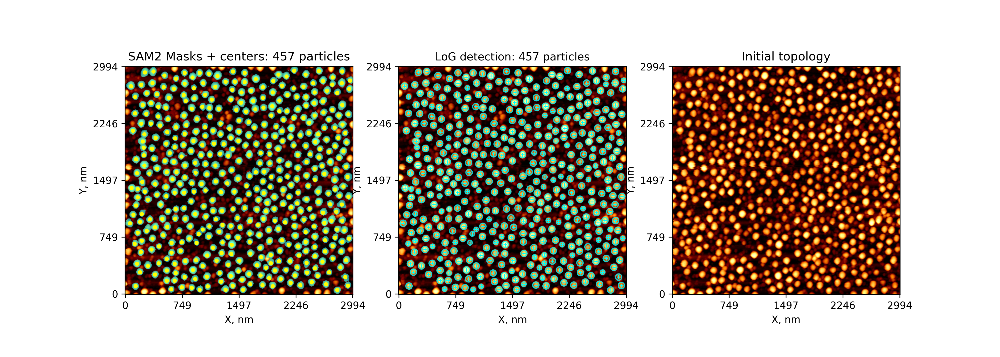
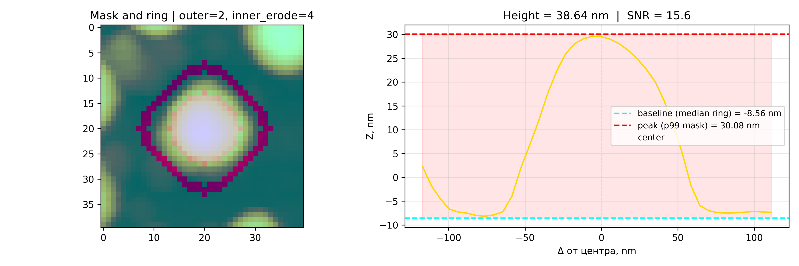
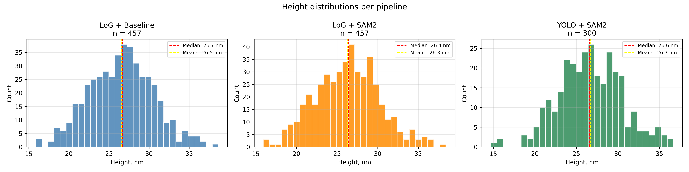
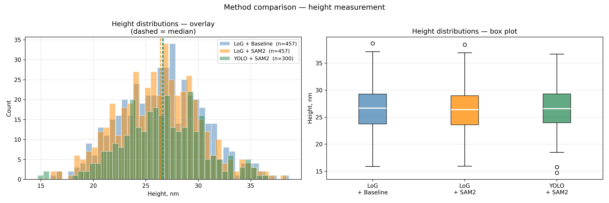

# AFM Nanoparticle Analysis

Automated pipeline for loading AFM height maps, background removal, nanoparticle detection, and height measurement.


---

## What It Does

Atomic Force Microscopy (AFM) produces a height map where every pixel stores the local height in nanometers. This project automates the full analysis chain:

1. Load a Bruker Nanoscope `.spm` file and decode calibrated height values.
2. Remove global tilt (least-squares plane fit) and per-line polynomial drift.
3. Estimate the substrate surface via morphological opening.
4. Detect particles above the substrate using Laplacian-of-Gaussian (LoG).
5. Measure each particle's height relative to a local ring baseline.

The output is a `pandas.DataFrame` — one row per particle — with coordinates, LoG radius, max height, mean height, and baseline diagnostics.

---

## Pipeline Overview

```
┌──────────────┐   ┌──────────────────────────────┐   ┌───────────────────────────┐   ┌──────────────────────────┐   ┌─────────────────┐
│  I/O         │→  │  Preprocessing               │→  │  Detection               │→  │  Measurement             │→  │  Results        │
│  afm_io.py   │   │  preprocess.py               │   │  detection.py            │   │  measure.py              │   │  DataFrame      │
│  load_afm()  │   │  flatten_plane()             │   │  estimate_log_params()   │   │  create_circular_mask()  │   │  CSV / plots    │
│              │   │  flatten_lines()             │   │  estimate_log_threshold_ │   │  get_clean_ring()        │   │                 │
│              │   │  build_substrate_map()       │   │    adaptive()            │   │  measure_height()        │   │                 │
│              │   │  get_substrate_map()         │   │  detect_particles()      │   │  measure_all_baseline()  │   │                 │
└──────────────┘   └──────────────────────────────┘   └───────────────────────────┘   └──────────────────────────┘   └─────────────────┘
```

An experimental SAM 2 path (`src/sam2_pipeline.py`, `sam2.ipynb`) is available for mask-based segmentation as an alternative to LoG.

---

## Installation

```bash
# Requires uv (https://docs.astral.sh/uv/)
uv sync
```

PyTorch is pulled from the CUDA 11.8 index. Edit `pyproject.toml` to switch to CPU or a different CUDA version.

SAM 2 is installed from its GitHub source; model checkpoints must be downloaded separately and placed in `checkpoints/`:

```bash
# Example — download SAM 2 base+ checkpoint
wget https://dl.fbaipublicfiles.com/segment_anything_2/092824/sam2.1_hiera_base_plus.pt \
     -O checkpoints/sam2.1_hiera_base_plus.pt
```

---

## Quick Start

```python
from src.afm_io import load_afm
from src.preprocess import flatten_plane, flatten_lines, build_substrate_map
from src.detection import detect_particles
from src.measure import measure_all_baseline

# 1. Load
scan_size_nm, pixel_size_nm, z = load_afm("data/sample.spm", fmt="spm")

# 2. Preprocess
z_flat = flatten_lines(flatten_plane(z), poly_order=1)
substrate, z_above, opening_radius, sizes = build_substrate_map(
    z_flat, pixel_size_nm, min_size_nm=5
)

# 3. Detect
blobs = detect_particles(z_above, pixel_size_nm, sizes, overlap=0.4)

# 4. Measure
df = measure_all_baseline(z_flat, z_above, blobs, outer_px=5, inner_erode_px=3)
print(df.head())
```

Batch preprocessing of a whole directory:

```bash
python preprocess_batch.py data/raw/ data/preprocessed/
```

This recursively finds all files with numeric extensions (`.001`, `.002`, …), applies the preprocessing pipeline, and saves `z_above` as a `.jpg` mirroring the input directory structure.

---

## Project Structure

```
AFM-analysis/
├── src/
│   ├── afm_io.py          # File I/O — Bruker Nanoscope .spm and .npy
│   ├── preprocess.py      # Plane/line flattening, substrate estimation
│   ├── detection.py       # LoG-based particle detection
│   ├── measure.py         # Height measurement, ring baseline
│   ├── visualization.py   # Static plots, interactive viewer
│   └── sam2_pipeline.py   # SAM 2 helpers (AFM→RGB conversion, mask overlay)
├── notebooks/
│   ├── afm_gold_nanoparticles.ipynb  # End-to-end analysis on real data
│   ├── preprocessing.ipynb           # Preprocessing exploration
│   └── sam2.ipynb                    # SAM 2 segmentation experiments
├── preprocess_batch.py    # CLI batch processor
├── tests/
│   └── test_io.py
├── checkpoints/           # Model weights (not committed)
├── data/                  # Raw AFM files (not committed)
├── docs/images/           # Pipeline figures
└── pyproject.toml
```

---

## Module Reference

### `src/afm_io.py` — I/O

| Function | Description |
|---|---|
| `load_afm(file_path, fmt)` | Load an AFM file. `fmt="spm"` returns `(scan_size_nm, pixel_size_nm, z)`; `fmt="npy"` returns `z`. |
| `make_synthetic_afm(size, n_particles, seed)` | Planned — not yet implemented. |

`load_afm` with `fmt="spm"` calls `_read_nanoscope_z`, which parses the Bruker Nanoscope header, extracts the Z-scale calibration (`Zsens` + `@2:Z scale`), and returns calibrated float32 heights in nanometres.

### `src/preprocess.py` — Preprocessing

| Function | Key parameters | Description |
|---|---|---|
| `flatten_plane(z)` | — | Remove global tilt via least-squares plane fit. |
| `flatten_lines(z, poly_order=1)` | `poly_order` | Row-by-row polynomial detrending. |
| `get_substrate_map(z, radius_px)` | `radius_px` | Morphological opening — substrate estimate. `radius_px` must exceed the largest particle radius. |
| `estimate_radius_otsu(z_above, pixel_size_nm, min_size_pixel)` | — | Otsu binarization → connected components → median equivalent radius. Raises `ValueError` if no objects found. |
| `estimate_rough_radius(z, pixel_size_nm, min_size_pixel, scale=1.7)` | `scale` | Fast radius estimate from median+std threshold. Falls back to 1% of image width if nothing is found. |
| `build_substrate_map(z, pixel_size_nm, min_size_nm=5, manual_radius_px=None)` | `manual_radius_px` | Two-stage auto-estimation (rough → Otsu) or manual radius. Returns `(substrate, z_above, opening_radius, sizes)`. |

### `src/detection.py` — Detection

| Function | Description |
|---|---|
| `estimate_log_params(sizes)` | Derives `min_sigma` / `max_sigma` from Otsu radii. |
| `estimate_log_threshold(z_above)` | Simple threshold: `3 × noise_std / z_max`. |
| `estimate_log_threshold_adaptive(z_above, params, percentile=20)` | Runs LoG at minimal threshold, takes the `percentile`-th response — robust across samples. |
| `detect_particles(z_above, pixel_size_nm, sizes, overlap=0.3, threshold=None, percentile=20)` | Full detection: sigma range → adaptive threshold → `blob_log` → boundary filter. Returns `(N, 4)` array `[y, x, sigma_px, radius_nm]`. |

### `src/measure.py` — Measurement

| Function | Description |
|---|---|
| `create_circular_mask(shape, cy, cx, radius)` | Boolean disk mask. |
| `get_clean_ring(mask_particle, substrate_mask, outer_px, inner_erode_px)` | Ring around particle, restricted to substrate pixels (removes overlapping neighbours automatically). |
| `measure_height(z_flat, mask_particle, substrate_mask, global_baseline, ...)` | `height = max(z inside mask) − median(z in ring)`. Falls back to global baseline when ring < `min_ring_px`. |
| `measure_all_baseline(z_flat, z_above, blobs, outer_px=5, inner_erode_px=3)` | Runs `measure_height` for every blob. Drops particles with `height ≤ 0`. Returns DataFrame. |

### `src/visualization.py` — Visualization

| Function | Description |
|---|---|
| `plot_afm(ax, z, scan_size_nm, ...)` | Static AFM height map on a matplotlib axis. |
| `afm_viewer(z, scan_size_nm, ...)` | Interactive viewer with crosshair, hover tooltip, and two-point height profile. |
| `plot_detections(z_above, blobs, pixel_size_nm, axes)` | LoG detection overlay (cyan circles). |
| `plot_detections_histogram(blobs, axes)` | Radius histogram with median/mean lines. |

### `src/sam2_pipeline.py` — SAM 2 (experimental)

| Function | Description |
|---|---|
| `afm_to_rgb(z, colormap, clip_percentile)` | Converts float Z-map to uint8 RGB for SAM 2 input. |
| `overlay_masks(rgb_img, sam_results, alpha)` | Overlays SAM 2 segmentation masks with random colors. |

---

## Parameters

| Parameter | Default | Effect | Increase when | Decrease when |
|---|---|---|---|---|
| `opening_radius_px` | auto | Structural element radius for morphological opening | Substrate retains wide humps from large particles | Background over-smoothed, eating fine structure |
| `log_threshold` | None (adaptive) | Minimum LoG response to count as a particle | Many false positives on noise | Missing faint / low particles |
| `overlap` | `0.3` | Allowed overlap between two LoG blobs before merging | Dense clusters split into duplicates | Close particles wrongly merged |
| `inner_erode_px` | `3` | Inward margin from mask edge before building baseline ring | Particle slope leaks into baseline | Ring too narrow, too few baseline pixels |
| `outer_px` | `5` | Ring width for local baseline | More substrate pixels needed for stable median | Neighbours or uneven background enter the ring |

---

## Output Format

`measure_all_baseline()` returns a DataFrame with the following columns:

| Column | Type | Meaning |
|---|---|---|
| `particle_id` | `int` | Index in the `blobs` array |
| `x_px`, `y_px` | `int` | Particle centre in pixels |
| `sigma_px` | `float` | LoG sigma (pixels) |
| `radius_nm` | `float` | Particle radius in nm (`sigma × √2 × pixel_size_nm`) |
| `method` | `str` | Always `baseline_circle` |
| `height_nm` | `float` | Max height above local baseline |
| `mean_nm` | `float` | Mean height inside mask above baseline |
| `baseline_nm` | `float` | Local ring or global baseline value |
| `area_px` | `int` | Circular mask area in pixels |
| `ring_px` | `int` | Number of clean ring pixels used for baseline |
| `baseline_source` | `str` | `ring` or `global` |

---

## Example Output

| particle_id | x_px | y_px | sigma_px | radius_nm | height_nm | mean_nm | baseline_nm | ring_px | baseline_source |
|---|---:|---:|---:|---:|---:|---:|---:|---:|---|
| 0 | 100 | 78 | 5.58 | 30.8 | 23.05 | 13.80 | −1.84 | 315 | ring |
| 1 | 170 | 191 | 4.48 | 24.8 | 20.05 | 14.79 | 0.09 | 214 | ring |

---

## Pipeline Figures







---

## Known Limitations

- `make_synthetic_afm()` is declared but not implemented (`pass`). Synthetic data for testing must be created manually.
- `load_afm(fmt="spm")` returns a 3-tuple `(scan_size_nm, pixel_size_nm, z)`, not a bare 2-D array as the docstring states.
- `load_afm` docstring advertises `.ibw` and `.gwy` support; only `spm` and `npy` are implemented.
- `detect_particles` normalises by `z_above.max()` — will divide by zero on an all-zero or negative-only map.
- `estimate_radius_otsu` raises `ValueError` if Otsu finds no objects.
- `estimate_rough_radius` falls back to 1% of image width and prints a warning to stdout.
- When the local baseline ring has fewer than `min_ring_px` pixels, `measure_height` falls back to a global baseline, which may mask local background variation.
- The SAM 2 path is experimental and has no CLI or notebook-agnostic entry point yet.
