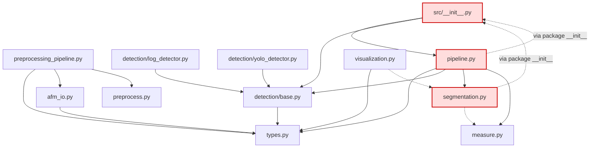

# Baseline audit — `afm-analysis`

**Date:** 2026-07-28
**Commit:** `11e0ecc` (frontend init)
**Scope:** Phase 0. Read-only with respect to functional code. No behaviour was changed.
**Method:** every finding below was reproduced by executing the code, not by reading it alone.
Reproduction scripts are quoted inline; numerical claims are measured values.

---

## 0. Summary

The Python library is a working AFM research pipeline with a coherent core idea (flatten →
substrate → detect → measure) and a genuinely good separation of SAM2 behind lazy imports.
It is not yet a product: the two-pillar promise (detection + segmentation across TEM/SEM/AFM)
is honoured for AFM only, SEM/TEM has no reachable file-loading entry point, and the numerical
layer carries several silent correctness defects that affect real data today.

Three findings dominate everything else:

1. **The YOLO input pipeline destroys ~87% of the image's dynamic range** before inference
   (`astype(uint8)` precedes normalisation). Measured: 32 surviving grey levels out of 253.
2. **On 90% of the operator's own scans the minimum-particle-size filter is silently disabled**
   because `int(min_size_nm / pixel_size_nm)` floors to zero. This corrupts the radius statistics
   that set the LoG sigma range, so it propagates into every detection.
3. **`frontend/node_modules` is committed** — 2 800 files, 78.3 MB, 98% of all tracked files.

Counts: **24 confirmed defects** (5 critical, 5 high, 11 medium, 3 low), **5 import cycles**,
**10 dead or unreachable functions**, **0 meaningful tests**.

---

## 1. Module inventory

Legend — **Live**: on a working call path. **Notebook-only**: only reachable from a committed
notebook. **Dead**: no caller anywhere in the repository.

| Module | LOC | Status | Notes |
|---|---:|---|---|
| `src/types.py` | 100 | Live | Dataclass root. Not actually importable in isolation (D-18). |
| `src/afm_io.py` | 174 | Partly live | `load_afm` live; `load_microscopy_image` **dead**; `make_synthetic_afm` is a `pass` stub. |
| `src/preprocess.py` | 203 | Live | Manual-radius branch is **100% broken** (D-01). |
| `src/preprocessing_pipeline.py` | 68 | Notebook-only | `run_preprocessing` has no in-repo caller. |
| `src/detection/base.py` | 44 | Live | Protocol parameter is named `z_above` — an AFM term in modality-neutral code. |
| `src/detection/log_detector.py` | 266 | Live | `estimate_log_threshold` **dead** (superseded by the adaptive variant). 9 `print` calls. |
| `src/detection/yolo_detector.py` | 133 | Live | Input preparation corrupts data (D-03). Confidence discarded (D-09). |
| `src/segmentation.py` | 237 | Live | Best-isolated module. Emits two different names for the same score (D-17). |
| `src/measure.py` | 236 | Live | Returns a zero-column DataFrame on empty input (D-08). 3 `print` calls. |
| `src/pipeline.py` | 146 | Live | `if/elif` detector dispatch; validation after inference (D-14). `run_full_pipeline` **dead**. |
| `src/visualization.py` | 390 | Notebook-only | `plot_pipeline_result`, `plot_detections_histogram` **dead**. Crashes on empty results (D-08). |
| `preprocess_batch.py` | 87 | **Dead — broken** | Unpacks `AFMRawData` as a 3-tuple; fails on every file (D-02). |
| `tests/test_io.py` | 10 | **Non-test** | No assertions; wrong exception caught; references a non-existent path (D-20). |
| `frontend/src/**` | 21 files | Live (no server) | Hardcodes the capability matrix; consumes fields Python never produces (D-19). |

### Dead / unreachable functions (verified: no caller in `src/`, root scripts, or notebooks)

`estimate_log_threshold`, `make_synthetic_afm`, `load_microscopy_image`, `run_full_pipeline`,
`plot_pipeline_result`, `plot_detections_histogram`, plus `run_preprocessing`, `afm_viewer`,
`plot_detections`, `YoloDetector.last_result` reachable only from notebooks.

`load_microscopy_image` being dead is structural, not cosmetic: **it is the only file-loading
entry point for SEM/TEM**, and nothing calls it. `MicroscopyData` can currently only be
constructed by hand, so the SEM/TEM half of the product has no working front door.

### Duplication

- `radii_nm = radii_px * pixel_size_nm` computed twice in a row — `preprocess.py:108-109`.
- `radius_px = sigma * sqrt(2)` reimplemented in five places: `base.py:33`, `log_detector.py:168`,
  `log_detector.py:202`, `measure.py:151`, `segmentation.py:143`, `visualization.py:235`.
  This is the single most-repeated magic relationship in the codebase and has no named constant.
- Substrate-mask derivation (`z < threshold_otsu(z)`) duplicated in `measure.py:137-138` and
  `segmentation.py:135-138, 201-204`.
- The SAM2 record-assembly loop is copy-pasted between `run_sam2_from_blobs` and
  `run_sam2_from_boxes`, and the two copies have **drifted** (`score` vs `sam_score`).

---

## 2. Defect register

Severity: **Critical** = wrong results or total failure on a normal path · **High** = wrong
results on a reachable path or crash on documented input · **Medium** = contract violation,
latent corruption, or unusable error · **Low** = hygiene.

### D-01 · Critical · `build_substrate_map` manual branch raises `UnboundLocalError`

`src/preprocess.py:183-202` — the manual branch never assigns `opening_radius`, which the
shared `return` at line 202 requires.

```python
>>> build_substrate_map(z, pixel_size_nm=1.0, manual_radius_px=15)
UnboundLocalError: cannot access local variable 'opening_radius'
                   where it is not associated with a value
```

**Blast radius:** the entire documented manual-radius workflow. Anyone tuning the opening radius
by hand — the recommended remedy when automatic estimation misbehaves — hits this immediately.

### D-02 · Critical · `preprocess_batch.py` unpacks `AFMRawData` as a 3-tuple

`preprocess_batch.py:29`

```python
scan_size_nm, pixel_size_nm, z = load_afm(str(src), fmt="spm")
# TypeError: cannot unpack non-iterable AFMRawData object
```

`load_afm` returned `(scan_size_nm, pixel_size_nm, z)` in an earlier revision and now returns an
`AFMRawData`. The CLI was never updated. Every file fails, and the blanket `except Exception` at
line 79 converts the crash into a per-file `FAILED` line, so the script exits reporting
`0 converted, N failed` rather than surfacing the real cause.

**Blast radius:** the batch CLI is entirely non-functional. `README.md` still documents the old
3-tuple convention, so the documentation agrees with the broken caller and disagrees with the code.

### D-03 · Critical · YOLO input casts to `uint8` *before* normalising

`src/detection/yolo_detector.py:55-56`

```python
img = cv2.resize(z_above, (self.yolo_size, self.yolo_size)).astype(np.uint8)  # <- truncates
img = cv2.normalize(img, None, 0, 255, cv2.NORM_MINMAX)                       # <- too late
```

Measured on a realistic AFM `z_result` (512×512, 0–31.4 nm, 261 359 distinct float values):

| | unique grey levels | information retained |
|---|---:|---:|
| current (`cast → normalize`) | **32** | **12.6 %** |
| correct (`normalize → cast`) | 253 | 100 % |

For maps whose range exceeds 255 nm the cast also **wraps**: correlation with the correctly
prepared image falls to **0.801**. Monotonicity is destroyed outright —
input `[-10, -1, 0, 1, 5, 100, 260, 300]` becomes `[246, 255, 0, 1, 5, 100, 4, 44]`.

**Blast radius:** every YOLO detection, both the tiled and direct backends (both call
`_prepare_image`). Detection quality, radii, and any benchmark run against this path are all
affected. This defect alone makes a classical-vs-learned comparison meaningless.

### D-04 · Critical · `min_size_pixel` floors to zero on most real scans

`src/preprocess.py:186, 190, 195` — `min_size_pixel=int(min_size_nm / pixel_size_nm)`.

Measured across 120 of the operator's own SPM scans in `data/`:

- `pixel_size_nm`: min 1.95, **median 9.77**, max 29.30
- default `min_size_nm = 5`
- **108 / 120 scans (90 %)** produce `min_size_pixel == 0`

With the floor at zero the noise filter in `estimate_radius_otsu` (`radii_px >= min_size_pixel`)
admits every connected component, including single-pixel noise. Those radii set
`typical_radius_px`, which sets the opening radius **and** the LoG sigma range.

**Blast radius:** the corruption enters at the earliest numerical stage and propagates to every
detection and every measurement downstream, silently, on the majority of real data. Note the
unit confusion behind it: a *minimum size* is floored with `int()` rather than rounded or
enforced as a positive lower bound.

### D-05 · High · `estimate_radius_otsu` returns `NaN` instead of raising

`src/preprocess.py:103-121`. When the size filter removes every component, `np.median([])`
returns `nan` with only a `RuntimeWarning`:

```python
>>> estimate_radius_otsu(z, 1.0, min_size_pixel=500)
{'typical_radius_px': nan, 'typical_radius_nm': nan, 'radii_px': array([], dtype=float64),
 'n_objects': 4, ...}
```

The `nan` survives until `estimate_log_params` fails far from the cause:

```
ValueError: zero-size array to reduction operation minimum which has no identity
```

The guard at line 97 only covers `len(props) == 0` *before* filtering, never after.

### D-06 · Medium · `n_objects` reports the pre-filter count

`src/preprocess.py:119` returns `len(props)` while `radii_px` was filtered at lines 106-107.
Measured: **4 reported, 2 retained**. `PROJECT_CONTEXT.md` §6.3 documents it as "object count",
so any caller trusting it over-counts particles.

### D-07 · High · Unknown pixel scale (`None`) crashes both detectors

`MicroscopyData.nm_per_pixel` is typed `float | None` and the frontend sends `nm_per_pixel?`
as optional, so "scale unknown" is an explicitly supported state. Both detectors multiply by it
unconditionally — `yolo_detector.py:119`, `log_detector.py:168`:

```
TypeError: unsupported operand type(s) for *: 'float' and 'NoneType'
```

This violates the project invariant that physical values must be `None` when scale is unknown —
never zero, never pixel-valued, and certainly never a crash.

### D-08 · High · Empty measurements produce a **zero-column** DataFrame

`src/measure.py:179` — `pd.DataFrame([])` has no columns, so consumers reading by name raise
`KeyError` rather than seeing an empty column. Reproduced end to end:

```python
>>> plot_pipeline_result(result_with_no_particles, z, scan)
KeyError: 'height_nm'
```

Triggered by a genuinely ordinary outcome: no particles detected, or every height filtered as
non-positive at `measure.py:166`.

### D-09 · Medium · YOLO confidence is discarded

`src/detection/yolo_detector.py:105-122` never assigns `confidence`, so every YOLO detection
carries the dataclass default `1.0`. `cfg.yolo_conf` filters detections but the per-particle
score is dropped. The frontend renders `confidence` and will always show 100%.

### D-10 · Medium · `estimate_rough_radius` return-type lie and asymmetric structuring element

`src/preprocess.py:123` is annotated `-> int` but returns `max(radius_px * scale, min_size_pixel)`
— a float (measured: `11.9`, type `float`). Passed to `disk()`, half-integer radii yield an
**even-sized** structuring element with no centre pixel:

| radius | `disk()` shape | centred? |
|---|---|---|
| `8` | (17, 17) | yes |
| `8.5` | (18, 18) | **no** |
| `11.9` | (25, 25) | yes |

Reachable whenever `radius_px * 1.7` lands on `.5` (e.g. `radius_px = 5`), biasing the
morphological opening by half a pixel — a real, if small, shift in `z_result`.

### D-11 · Medium · LoG normalises by a possibly zero maximum

`src/detection/log_detector.py:85` and `:151` — `z_norm = z_above / z_above.max()`. For a flat
map this is `0/0`, producing an all-`NaN` image; `blob_log` then returns zero blobs and the code
prints "particles not found", attributing a numerical failure to a detection threshold.
`build_substrate_map` guarantees `z_above >= 0` (opening is anti-extensive), so a *negative*
maximum is unreachable through that path — but `max() == 0` is reachable, and `LogDetector.detect`
is also called directly on arbitrary images (see D-12).

### D-12 · High · SEM/TEM route raw images through an AFM-shaped detector

`src/pipeline.py:51` passes `MicroscopyData.image` straight into `LogDetector.detect(..., sizes=None)`.
The detector then Otsu-thresholds the raw image and keeps the **bright** side as particles
(`log_detector.py:247-248`). TEM particles are conventionally **dark on bright**, so for TEM the
detector characterises the background.

There is no polarity concept anywhere in the codebase, and no test covers it. The
`tem_dark_particles` phantom added in this audit is the counter-example.

### D-13 · Medium · `flatten_lines` silently truncates integer input

`src/preprocess.py:49` — `np.empty_like(z)` preserves the input dtype, so float residuals are
truncated on assignment. Measured on a uint8 linear ramp: correct residual max `0.5625`,
actual output **all zeros**. `flatten_plane` promotes to float64; `flatten_lines` does not — the
two halves of "flattening" disagree about dtype. Latent for SPM/NPY (float32) and live for any
integer-valued image.

### D-14 · Medium · Mode validation runs after the detector

`src/pipeline.py` — the detector block begins at line 58; the `mode="baseline"` validity checks
are at lines 88-92. Requesting AFM + YOLO + baseline runs a complete YOLO inference pass, then
raises `ValueError`. With SAM2-scale runtimes this is minutes of wasted GPU work for an input
that was invalid before any compute started.

### D-15 · Medium · No input validation; errors leak from library internals

| Input | Current behaviour |
|---|---|
| `run_pipeline("not-data", cfg)` | `AttributeError: 'str' object has no attribute 'image'` |
| 3-D array | `ValueError: too many values to unpack (expected 2)` (from `flatten_plane`) |
| array containing `NaN` | `ValueError: array must not contain infs or NaNs` (from `scipy.lstsq`) |
| 1×1 array | `ValueError` with a Russian message, from Otsu |
| all-zero array | no error; silently returns zero detections |

None of these is a typed, actionable error naming the offending parameter.

### D-16 · Medium · `Detection.bbox` defaults to an empty tuple

`src/types.py:63` — `field(default_factory=tuple)` produces `()` while the annotation promises
`tuple[int, int, int, int]` and the TypeScript contract requires exactly four numbers.

### D-17 · Medium · The measurement schema differs across all four producers

| Producer | Extra vs TS `ParticleMeasurement` | Missing vs TS |
|---|---|---|
| `measure_all_baseline` | `area_px, baseline_source, mean_nm, method, particle_id, ring_px, sigma_px` | `area_nm2, aspect_ratio, circularity, peak_nm` |
| `run_sam2_from_blobs` (AFM) | `log_radius_nm, mask_area_px, score` | `area_nm2, aspect_ratio, circularity, radius_nm` |
| `run_sam2_from_boxes` (AFM) | `mask_area_px, sam_score` | `area_nm2, aspect_ratio, circularity, radius_nm` |
| `run_sam2_*` (SEM/TEM) | `area_px, radius_px, score` | `baseline_nm, height_nm, peak_nm` |

Note `score` vs `sam_score`: the same SAM2 quantity is emitted under two different names by two
functions that were copy-pasted and then drifted (`segmentation.py:157` vs `:222`).

### D-18 · High (architectural) · Five import cycles; `src.types` is not a dependency root

`src/__init__.py:3` imports `.pipeline`, which imports `src.segmentation`, `src.detection`,
`src.measure` and `src.types`. Because Python executes `src/__init__.py` before any submodule,
**importing the "dependency root" loads the whole graph**:

```
import src.types  ->  1179 modules, 0.67 s, matplotlib=True, pandas=True
```

Cycles found:

```
src -> src.pipeline -> src
src -> src.pipeline -> src.segmentation -> src
src.pipeline -> src -> src.pipeline
src.pipeline -> src.segmentation -> src -> src.pipeline
src.segmentation -> src -> src.pipeline -> src.segmentation
```

`PROJECT_CONTEXT.md` §4 asserts "`src.types` is intentionally the dependency root and imports no
other `src` module". The first half is true of the file and false of the package.

### D-19 · Critical (hygiene) · `frontend/node_modules` is committed

| Metric | Value |
|---|---|
| tracked files under `frontend/node_modules` | **2 800** |
| their size | **78.3 MB** |
| share of all 2 854 tracked files | **98.1 %** |
| `.git` directory | 81 MB |

`.gitignore` covers `data/`, `checkpoints/`, `dataset/` but **not** `node_modules`, `output/`,
`*.pt`, or `.zip`. Related:

- `yolov8s-world.pt` is **staged in the index** (`git ls-files -s` shows mode 100644) while
  deleted from the working tree — a model checkpoint on its way into history.
- `main.ipynb` is a **0-byte tracked file** and is not valid JSON.
- `afm_gold_nanoparticles.ipynb` (6.5 MB) and `preprocessing.ipynb` (2.2 MB) are committed
  **with outputs** (24 and 6 output blocks).
- `.gitignore` ignores `plan.md` and `.claude`, so agent configuration cannot be shared.

### D-20 · Medium · No test or lint tooling is declared or installed

`pyproject.toml` declares neither `pytest`, `ruff`, nor `mypy`, and none is present in `.venv`:

```
pytest MISSING · ruff MISSING · mypy MISSING
```

`PROJECT_CONTEXT.md` §14 nevertheless presents `pytest` and `ruff check .` as the configured
checks. The sole test is not a test:

```python
def test_load_spm():
    try:
        z = load_afm("data/5.011", fmt="spm")   # path absent from a clean checkout
    except ImportError:                          # load_afm raises FileNotFoundError, not ImportError
        return
    # no assertions at all
```

The `[tool.ruff]` block also uses the deprecated top-level `select`/`ignore` keys instead of
`[tool.ruff.lint]`, and `known-first-party = ["your_package_name"]` is an unedited template value.
Stale `.pyc` files in `tests/__pycache__` are from CPython 3.14 while the venv is 3.12 — the
tests were last executed under a different interpreter.

### D-21 · Medium · YOLO squashes non-square scans

`_prepare_image` resizes to `640 × 640` regardless of the input aspect ratio; `_scale_boxes` then
applies **anisotropic** scale factors back. For a 256 × 512 scan the x and y factors differ by 2×,
so a circular particle is an ellipse in model space and `radius_px = min(w, h) / 2` is not a
physical radius.

### D-22 · Low · 197 lines of Russian in library code

Across `afm_io.py` (13), `log_detector.py` (58), `measure.py` (43), `preprocess.py` (61),
`visualization.py` (22). **Nine** reach runtime output as `print`/`raise` text, including the
`ValueError` message from `estimate_radius_otsu` and all LoG progress reporting. Mixed-language
diagnostics in a product surface are a support problem, not a style preference.

### D-23 · Low · 13 `print` calls in library code

`log_detector.py` (9), `measure.py` (3), `preprocess.py` (1). Ruff is configured with `T20`
(flake8-print) enabled, so these would fail lint if lint ran.

### D-24 · Low · `README.md` is stale

Referenced but absent: `src/detection.py`, `src/sam2_pipeline.py`, `sam2.ipynb`. It documents
`load_afm(fmt="spm")` as returning a 3-tuple `(scan_size_nm, pixel_size_nm, z)` — the convention
that `preprocess_batch.py` still follows and the code abandoned (D-02).

---

## 3. Dependency graph

Top-level imports are solid arrows; imports deferred inside function bodies are dashed.



**Cycles: 5**, all mediated by `src/__init__.py` (highlighted). They do not deadlock only because
`src.types` happens to import nothing internal — a property no one is enforcing.

**Upward dependencies:** none from `viz` into core (good). `segmentation.py` defers its import of
`measure` into the function body — intentional and correct, but it is load-bearing rather than
documented, and a future top-level import would close a sixth cycle.

**External weight at import time:** `matplotlib` and `pandas` load for *any* `src` import, because
`segmentation.py:9` imports `matplotlib.pyplot` at module scope purely for the `afmhot` colormap
in `afm_to_rgb`. `torch`, `cv2`, `ultralytics`, and `patched_yolo_infer` are correctly deferred.

---

## 4. Coupling map

### AFM-specific logic sitting in modality-neutral code

| Location | Leak |
|---|---|
| `detection/base.py:16` | The `Detector` protocol names its parameter `z_above` — a height-map concept — for all modalities. |
| `detection/log_detector.py` | Every docstring and log line assumes a substrate and a height map; SEM/TEM use it verbatim. |
| `segmentation.py:133, 199` | `afm_to_rgb()` applies the `afmhot` colormap to SEM/TEM images unconditionally. |
| `segmentation.py:70` | Modality is inferred from `z_flat is not None` — a nullable argument doubling as a type tag. |
| `pipeline.py:44` | Modality is inferred from `isinstance(data, PreprocessingResult)`. No `Modality` value exists. |
| `visualization.py:333, 349` | Hardcoded `afmhot` and nm axes for all result types. |

### Modality-neutral logic trapped in AFM-specific modules

| Location | Leak |
|---|---|
| `measure.py:184` | `measure_geometry_from_mask` is pure geometry, usable by every modality, but lives in the AFM height-measurement module. |
| `measure.py:11` | `create_circular_mask` is a general utility inside an AFM module. |
| `segmentation.py:26` | `overlay_masks` is pure rendering inside the segmentation module, and `visualization.py` imports it back — the layering is inverted. |

### The capability matrix has no owner

The permitted combinations of modality × detector × mode exist in **three** places that must be
kept in sync by hand, and already disagree:

1. `pipeline.py:88-92` — two `ValueError`s, raised after inference.
2. `frontend/src/components/ConfigPanel.tsx:109, 132` — `baseline` disabled for non-AFM,
   plus a silent mode rewrite when modality changes.
3. `PROJECT_CONTEXT.md` §9 — a prose table.

Nothing derives from anything else. The frontend's rule is a reimplementation of the backend's,
written from the documentation.

---

## 5. Risk register for the Phase 2 refactor

Probability that the change moves scientific output, if performed as a pure restructuring.

| # | Proposed change | P(output changes) | Why | Mitigation |
|---|---|---:|---|---|
| R1 | Package move `src/` → `src/nanoparticles/`, delete `pytest.ini` path hack | **~0** | Import paths only. | Golden compare before/after. |
| R2 | Registry + protocol replacing `if/elif` dispatch | **Low** | Same callables, new lookup. Risk is argument-passing drift (`sizes=` is LoG-only today). | Keep `detect()` signatures byte-identical in the first commit. |
| R3 | `Modality` enum + capability matrix | **Low** | Adds rejections earlier; does not change accepted-path maths. Fixes D-14 as a side effect. | Assert the accepted set is unchanged. |
| R4 | pydantic v2 config | **Low–Medium** | Defaults are the risk: any silent coercion (`int` vs `float` for radii) changes `disk()` (D-10). | Pin every default to its current literal; test the resolved config dict. |
| R5 | Structured logging replacing `print` | **~0** | Output side-effect only. | — |
| R6 | **Fix D-03 (YOLO normalisation order)** | **Certain — intended** | Corrects a 12.6%-retention corruption. Detections will change, likely substantially. | ADR + re-baseline + before/after benchmark. Do **not** bundle with anything else. |
| R7 | **Fix D-04 (`min_size_pixel` floor)** | **Certain — intended** | Re-enables the noise filter on 90% of real scans; radius statistics and sigma ranges move. | ADR + re-baseline. Needs an operator decision on the correct `min_size_nm` semantics. |
| R8 | Fix D-01 (manual radius) | **~0** | Currently raises 100% of the time; nothing to regress. | Test that fails before, passes after. |
| R9 | Fix D-13 (`flatten_lines` dtype) | **Low** | Float paths unaffected; integer paths change from "all zeros" to correct. | Golden covers float; add an integer case. |
| R10 | Fix D-11 (division by zero max) | **Low** | Only affects maps that currently yield all-`NaN`. | Explicit degenerate-input tests. |
| R11 | Fix D-10 (int/float opening radius) | **Medium** | Changes the structuring element for half-integer radii → shifts `z_result` → shifts detections. | Quantify on the golden set; ADR on the rounding rule. |
| R12 | Explicit mask wire format (RLE) | **~0** for maths | Serialization only. | Round-trip test. |
| R13 | Fix D-12 (SEM/TEM polarity) | **Certain — intended** | TEM currently detects background. | Requires a domain decision: auto-detect polarity or make it explicit config. **Ask the operator.** |

**Rule for Phase 2:** R6, R7, R11 and R13 each change scientific output. Each needs its own
commit, its own ADR, and its own golden update. They must never be mixed with restructuring.

---

## 6. What Phase 0 did not cover

Stated so the gaps are not mistaken for clean bills of health:

- **No YOLO or SAM2 inference was executed.** Weights exist locally (`best12x.pt` 137 MB,
  `sam2.1_hiera_base_plus.pt` 324 MB) but running them is neither deterministic on this hardware
  nor reproducible in CI. D-03 was characterised on the input-preparation stage alone, which is
  where the defect lives.
- **The SPM parser was exercised on 120 of 628 local files**, all of which parsed. The regex
  assumptions in `_read_nanoscope_z` are unverified against other Nanoscope versions.
- **No frontend code was executed.** `npm run build` was not run; TypeScript findings come from
  reading `pipeline.ts` and `ConfigPanel.tsx`.
- **`.ibw` and `.gwy` are advertised in the `afm_io` docstring and not implemented** — noted, not
  counted as a defect, since `load_afm` correctly rejects unknown formats.

---

## 7. Companion documents

- `docs/audit/characterization-baseline.md` — the golden-file safety net and how to use it.
- `tests/characterization/phantoms.py` — deterministic synthetic fixtures with ground truth.
- `tests/characterization/capture.py` — the capture/compare runner.
